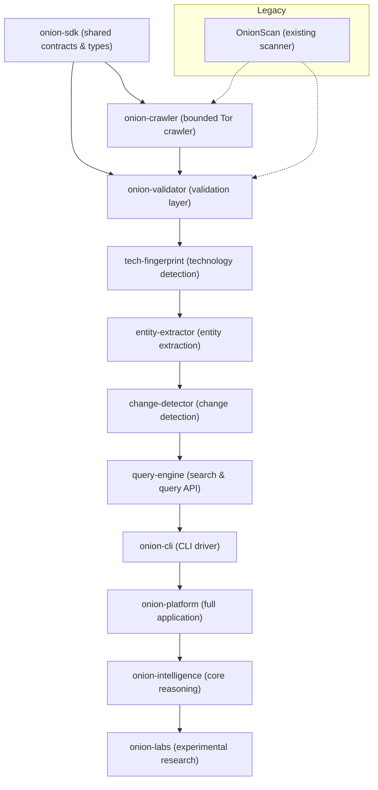

# ARCHITECTURE.md

## FLATLINEDSTAR Ecosystem Overview

### Component Responsibilities
| Component | Type | Role |
|-----------|------|------|
| **onion-sdk** | Library | Defines stable data models (e.g., `OnionTarget`, `OnionObservation`, `Technology`, `Entity`, `ChangeEvent`, `SearchQuery`, `SearchResult`). Shared across the ecosystem. |
| **onion-validator** | Library | Checks raw observations for schema correctness and security policy compliance. |
| **onion-crawler** | Application/Library | Tor‑aware bounded crawler that fetches pages and produces raw observations. |
| **tech-fingerprint** | Library | Generates `Technology` fingerprints from observations (headers, TLS, HTML). |
| **entity-extractor** | Library | Turns fingerprints into higher‑level `Entity` objects (CMS, frameworks, languages). |
| **change-detector** | Library | Detects additions, removals, or modifications between successive observations. |
| **query-engine** | Library | Provides search, filtering, and query APIs over stored observations and entities. |
| **onion-cli** | CLI | User‑facing command‑line tool that consumes the SDK and orchestrates end‑to‑end scans. |
| **onion-platform** | Application | Full runnable platform (API server, web UI, workers) that integrates all components. |
| **onion-intelligence** | Core Engine | Reasoning layer that consumes normalized data and produces actionable insights. |
| **onion-labs** | Experimental | Research sandbox for prototypes, new algorithms, and datasets. |
| **OnionScan** | Legacy | Existing scanner; kept for reference and possible migration of useful parts. |

### Data Flow
1. **Crawl** → raw pages (via Tor) → **Validator** checks → **Fingerprint** extracts tech → **Extractor** builds entities → **Change‑Detector** computes diffs → **Query‑Engine** indexes → **Intelligence** analyses → **Platform/CLI** present results.

## Guidance
- All components must depend *only* on `onion-sdk` for shared types to avoid circular dependencies.
- Versioned releases of `onion-sdk` should be used as the contract surface.
- Keep each repository independently buildable and testable.
- The flagship product is **onion-platform**, which consumes the entire stack; **onion-intelligence** is the core reasoning engine.
